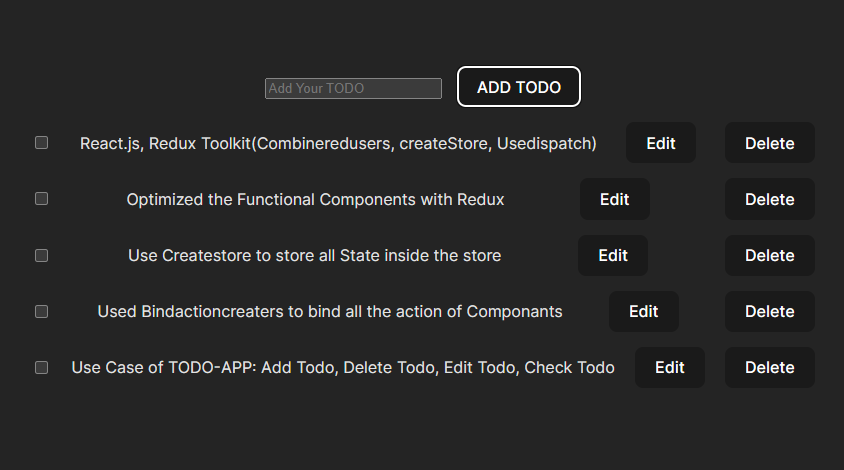

# React Todo App with Redux Toolkit 

## Overview

This is a simple React Todo App implemented with Redux Toolkit and Vite. It allows users to perform basic operations such as adding, deleting, updating, and checking the status of todos.

## Features

- Add new todos
- Delete existing todos
- Update todo details
- Mark todos as completed

## Screenshot
 

## Usage
- Add a new todo: Type your todo in the input field and press Enter or click the "Add Todo" button.
- Delete a todo: Click the delete button next to the todo you want to remove.
- Update a todo: Click on the todo text, make your changes, and press Enter.
- Mark a todo as completed: Click the checkbox next to the todo.

## Technologies Used

- React+Vite
- Redux Toolkit
- CreateStore
- Dispatch
- bindActionCreators

## Installation

1. **Clone the repository:**

    ```bash
    git clone https://github.com/your-username/react-todo-app.git
    ```

2. **Navigate to the project directory:**

    ```bash
    cd react-todo-app
    ```

3. **Install dependencies:**

    ```bash
    npm install
    ```

## Running the App

After the installation is complete, you can run the app using the following command:

```bash
npm run dev
